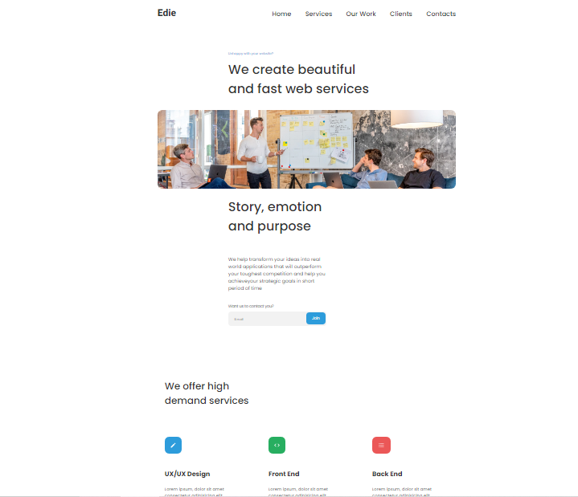
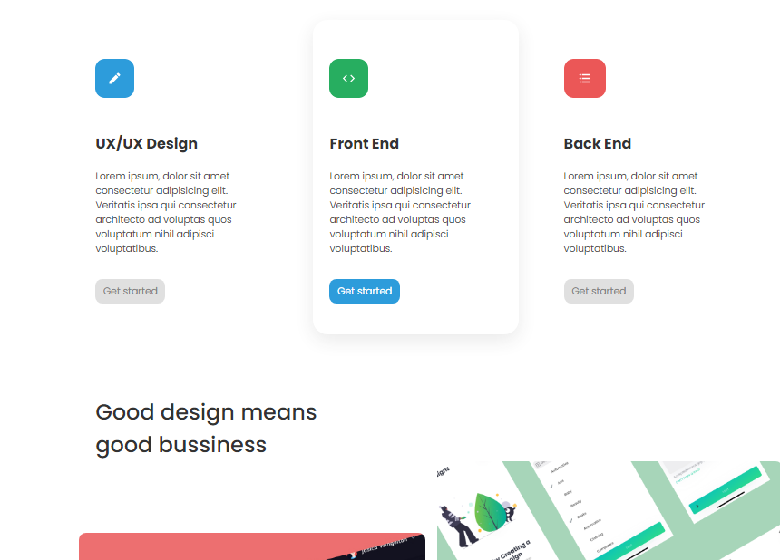

<h1 align="center">Edie Homepage</h1>

<div align="center">
  <h3>
    <a href="https://github.com/Voninkazo/edie-homepage">
      Demo
    </a>
    <span> | </span>
    <a href="https://edie-homepage-sandy.netlify.app/">
      Solution
    </a>
  </h3>
</div>

<!-- TABLE OF CONTENTS -->

# Table of Contents

-   [Overview](#overview)
-   [How to use](#how-to-use)
-   [Contact](#contact)
<!-- OVERVIEW -->

## Overview




## Built With
This website is built with:
 - [HTML](https://www.google.com/search?q=html&rlz=1C1AVFC_enMG885MG885&oq=html&aqs=chrome..69i57j0l2j69i61j69i60l2j69i65l2.1712j0j1&sourceid=chrome&ie=UTF-8),

 - [CSS](https://developer.mozilla.org/en-US/docs/Web/CSS)

 - [SCSS](https://sass-lang.com/guide)


## Use

<!-- Example: -->

To clone and run this application, you'll need [Git](https://git-scm.com) and [Node.js](https://nodejs.org/en/download/) (which comes with [npm](http://npmjs.com)) installed on your computer. From your command line:

```bash
# Clone this repository
$ git clone https://github.com/your-user-name/your-project-name

# Install dependencies
$ npm install

# Run the app
$ npm start
```

## Contact
-   GitHub [@Voninkazo](https://github.com/Voninkazo)